# JophNet - Network Inventory

JophNet is a web-based application designed to centralize the management of network infrastructure. It provides network administrators with a structured system for managing devices, interfaces, IP addresses, VLANs, locations, and operational statuses.

The application provides the following benefits:

- **Centralized management**: Maintains network information in one system.
- **Data consistency**: Enforces rules between devices and their interfaces.
- **Efficient access**: Provides search and filtering capabilities for network resources.
- **Status tracking**: Maintains a history of interface status changes.
- **Scalability**: Supports the addition of devices and future management features.

## Application Features

The application manages network devices such as routers, switches, firewalls, servers, access points, printers, and workstations. Each device can contain multiple interfaces with an interface name, MAC address, IP address, VLAN assignment, and operational status.

The main features and business rules include:

- Device management: Add, view, update, search, and filter network devices.
- Interface management: Manage interfaces associated with each device.
- VLAN management: Create VLANs and assign them to network interfaces.
- Location management: Organize devices by their physical or logical location.
- Status management: Manage Online, Offline, Maintenance, and Removed states.
- Status synchronization: When a device becomes Offline or Removed, its interfaces are automatically changed to Offline.
- Status validation: An interface cannot be changed to Online when its parent device is Offline, Maintenance, or Removed.
- Status history: Records interface status changes with the date, time, status, and reason.

## Technologies and Architecture

Joph Network Inventory uses the following technologies:

- Python: Implements server-side application logic.
- Django: Provides the web framework, processes requests, renders pages, and manages communication with the data layer.
- MySQL: Stores application data and uses stored procedures and transactions to enforce data and business rules.
- Docker: Runs the application components in isolated containers.
- Docker Network: Provides private communication between the containers.

The Django application and MySQL database run in separate Docker containers connected through the same Docker network. This architecture separates the application and database services, making the system easier to deploy, maintain, and expand.

## Application Usage

This section explains how to use JophNet and its main features. It provides a step-by-step guide for navigating the application, managing network resources, and accessing device and interface information.

---

## 1. Devices Page

The Devices page is the main page of JophNet. It displays the network devices stored in the application. In this example, no device has been added yet, so the page displays “No device found.”

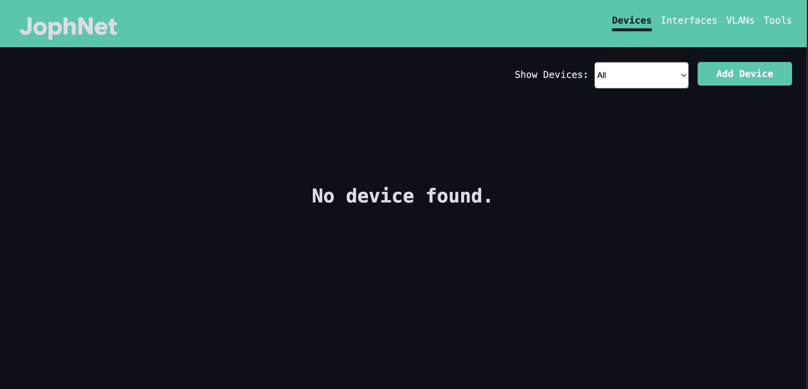
Figure 1. JophNet Devices Page

The page provides two main actions:

- Add Device: Opens the form used to register a new network device.
- Show Devices: Filters the device list by category, such as Router, Switch, Server, or Access Point.

The navigation menu provides access to Devices, Interfaces, VLANs, and Tools.

---

## 2. Add Device

From the Devices page, click Add Device to open the device registration form. The Add Device page is used to enter the information required to identify, classify, locate, and track a network device.

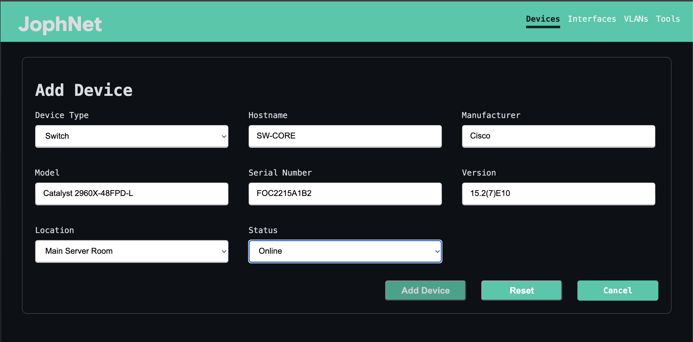
Figure 2. Add Device Page

Figure 2 shows an example of registering a Cisco switch:

- Device Type: Switch
- Hostname: SW-CORE
- Manufacturer: Cisco
- Model: Catalyst 2960X-48FPD-L
- Serial Number: FOC2215A1B2
- Version: 15.2(7)E10
- Location: Main Server Room
- Status: Online

Click Add Device to save the device. Reset clears the form, while Cancel returns to the previous page without saving.

--- 

## 3. Device Added

After the device is successfully registered, JophNet returns to the Devices page and displays a confirmation message. The new device is then listed with its type, hostname, manufacturer, model, serial number, version, location, and current status.

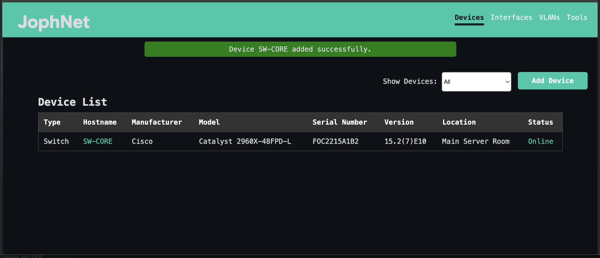
Figure 3. Device Successfully Added

The device list provides the following visual and navigation features:

- Hostname: The hostname displayed in green is a link. Click the hostname, such as SW-CORE, to open the device information page.
- Status: The status is color-coded for quick identification. Online is displayed in green, while Offline is displayed in red.
- Confirmation Message: A success message appears at the top of the page after the device is added successfully.

---

## 4. Device Information

After clicking the device hostname on the Devices page, JophNet opens the Device Information page. This page provides a detailed view of the selected device and its registered network interfaces.

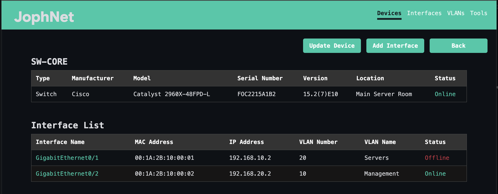
Figure 4. Device Information Page

The page is divided into two main sections:

- Device Information: Displays the device type, manufacturer, model, serial number, version, location, and current status.
- Interface List: Displays all interfaces registered to the device, including the interface name, MAC address, IP address, VLAN number, VLAN name, and status.

The page also provides three main actions:

- Update Device: Opens the form for modifying the device information.
- Add Interface: Registers a new interface to the current device.
- Back: Returns to the previous page.

The interface names are clickable and provide access to additional information and management options for each interface.

---

## 5. Add Interface

From the Device Information page, click Add Interface to register a new network interface for the selected device. The form collects the interface name, MAC address, IP address, VLAN assignment, and operational status.

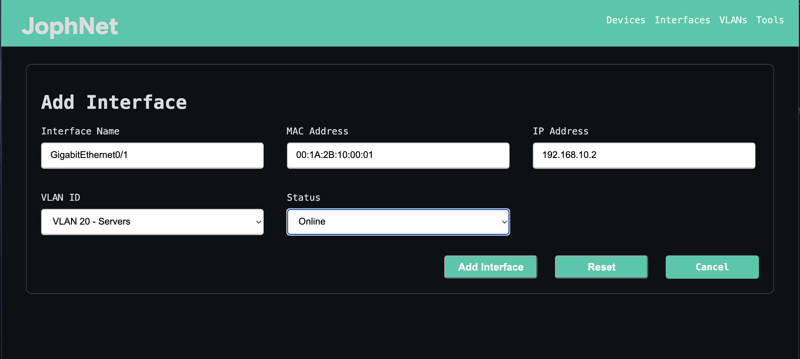
Figure 5. Add Interface Page

Figure 5 shows an example of adding a network interface with the following information:

- Interface Name: GigabitEthernet0/1
- MAC Address: 00:1A:2B:10:00:01
- IP Address: 192.168.10.2
- VLAN: VLAN 20 - Servers
- Status: Online

To prevent IP address conflicts, JophNet does not allow two interfaces with Online status to use the same IP address.

Click Add Interface to save the interface. Reset clears the form, while Cancel returns to the previous page without saving.

Figure 6 shows that the GigabitEthernet0/2 interface was added successfully to the device.

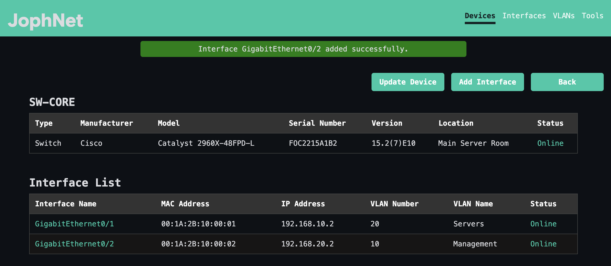
Figure 6. Interface GigabitEthernet0/2 Added Successfully

---

## 7. Interface Details and Status History

Clicking an interface name from the Device Information page opens the Interface Details page. The top section displays the interface information, including its MAC address, IP address, VLAN assignment, and current status. The bottom section displays the complete status history for the interface.

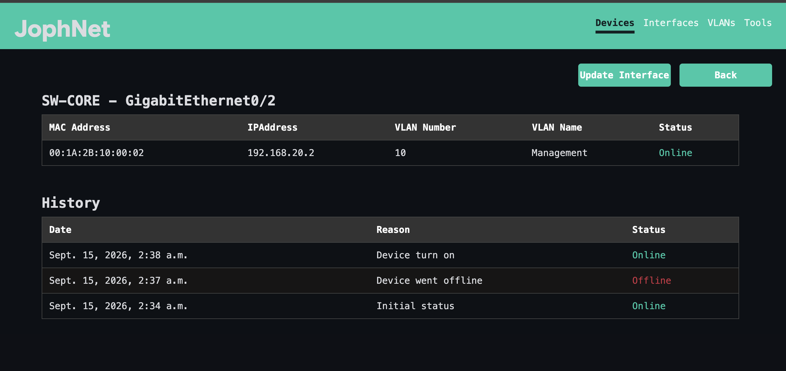
Figure 7. Interface Details and Status History

The status history provides the following information:

- Initial Status: Automatically recorded when the interface is first registered, including the date and time.
- Automatic Offline Status: When the parent device goes Offline, the interface is automatically changed to Offline and the event is recorded.
- Manual Status Change: Interfaces are not automatically returned to Online when the parent device comes back Online. The administrator must update the interface manually and provide a reason for the status change.
- Update Interface: Click Update Interface to modify the interface information or change its status.

Figure 8 shows the Update Interface page. The form allows the administrator to modify the interface name, MAC address, IP address, VLAN assignment, and status. The Update Reason is required only when the interface status is changed. A new entry is added to the Interface Status History only when the status changes. Updating other interface information without changing its status does not create a history record.

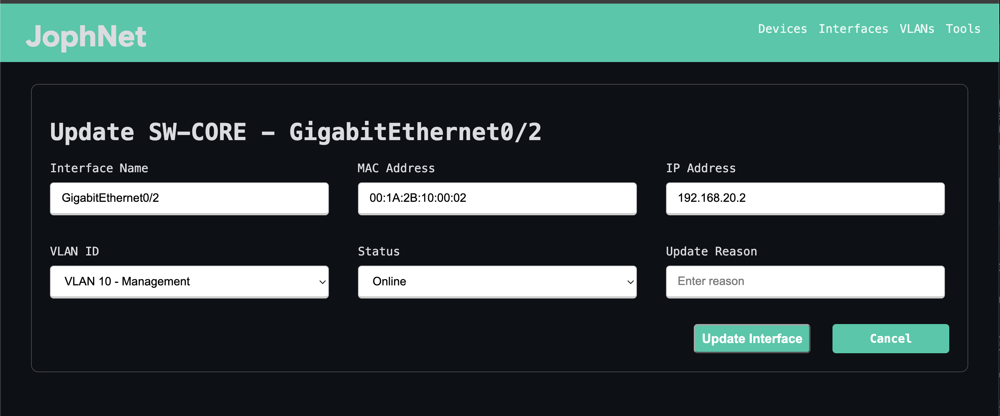
Figure 8. Update Interface Page

---

## 8. Interfaces Menu

The Interfaces menu provides a centralized view of the network interfaces registered across all devices in JophNet. Each row identifies the parent device and displays the interface name, MAC address, IP address, VLAN number, VLAN name, and current status.

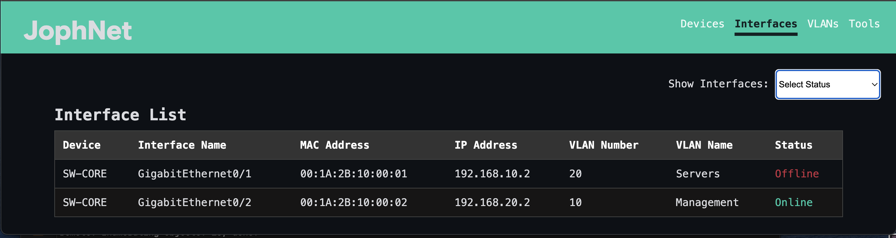
Figure 9. Interfaces Menu

The page provides one main action:

- Show Interfaces: The drop-down menu at the top-right filters interfaces by their operational status or displays all registered interfaces.

Interface statuses are color-coded, with Online displayed in green and Offline displayed in red for quick identification.

---

## 9. VLANs Menu

The VLANs menu provides a centralized view of all network interfaces that are assigned to a VLAN. For each interface, the list displays its VLAN name and number, the name and type of its parent device, the interface name, IP address, and current interface status.

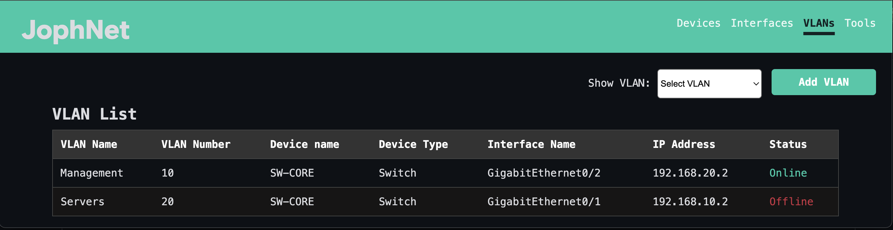
Figure 10. VLANs Menu

The page provides two main actions:

- Show VLAN: Filters the list by VLAN, allowing the administrator to view all interfaces assigned to a selected VLAN.
- Add VLAN: Opens the form used to register a new VLAN that does not already exist in JophNet.

Clicking Add VLAN opens the Add New VLAN page. The administrator enters the VLAN number and VLAN name before adding it to the system.

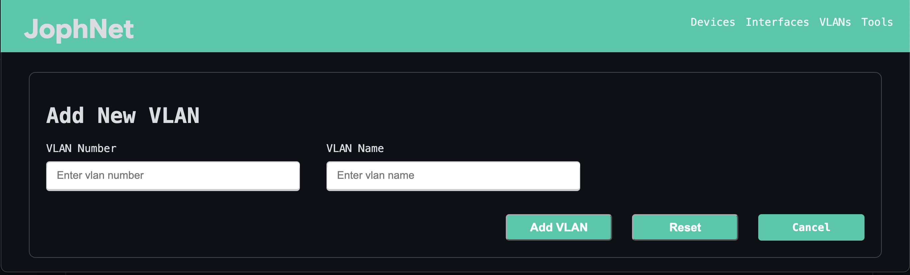
Figure 11. Add New VLAN Page

JophNet prevents duplicate VLAN configurations. The system does not allow two VLANs to be registered with the same VLAN number or VLAN name, helping maintain unique VLAN identification within the inventory.

---

## Conclusion

JophNet provides a centralized web-based solution for managing network devices, interfaces, VLANs, locations, operational statuses, and interface status history. The application combines network inventory management with business rules that maintain consistency between devices and their interfaces. Its current architecture using Python, Django, MySQL, and Docker also provides a foundation for adding more advanced network-management capabilities.

Future development will focus on reducing manual administration and providing more visibility into the network. Planned and potential features include:

- Automatic Interface Status Detection: JophNet will automatically determine whether registered network interfaces are Online or Offline instead of relying only on manual status updates.
- Automatic Device Monitoring: The system can periodically check registered devices and update their operational status when connectivity changes.
- Network Discovery: JophNet can scan authorized network ranges to discover new devices and interfaces that are not yet registered.
- Alerts and Notifications: Administrators can receive notifications when important events occur, such as a device or interface going Offline.

